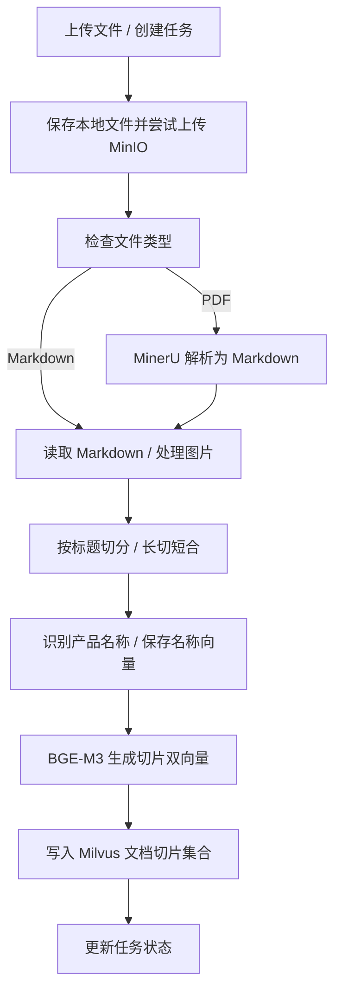
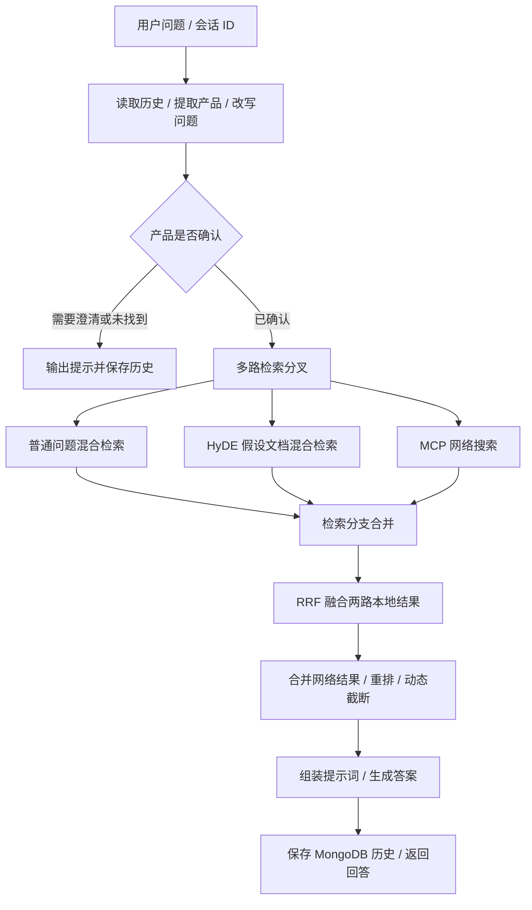

# 掌柜智库（knowledge-base）项目说明

掌柜智库是一个面向商品与设备使用手册的知识库问答项目。它将 PDF / Markdown 文档解析、切分并向量化，用户提问后，结合本地知识库与网络搜索结果生成回答。项目采用 Python、FastAPI 和 LangGraph，提供文档导入页面、聊天页面、导入进度查询及 SSE 流式问答接口。

本文根据当前仓库代码整理。项目版本为 `0.1.0`，主要用于学习与功能演示；以下启动方式和接口说明对应当前实现，完整业务运行需要准备外部服务和模型。

## 1. 主要功能

| 功能 | 当前实现 |
| --- | --- |
| 文档导入 | 接收一个或多个文件，每个文件生成独立任务 ID；入口支持小写扩展名 `.pdf` 和 `.md` |
| PDF 解析 | 调用 MinerU 云端 API，上传 PDF、轮询解析状态、下载并解压 Markdown 与图片 |
| 图片处理 | 扫描 Markdown 同目录的 `images/`，用视觉模型生成摘要，上传 MinIO 并替换图片链接 |
| 文档切分 | 按 Markdown 标题划分章节，对长内容进一步切分，并合并部分短内容 |
| 产品识别 | 从文档内容识别产品名称，将名称及其向量保存到 Milvus |
| 混合检索 | 使用 BGE-M3 生成稠密和稀疏向量，按产品名称过滤后检索文档切片 |
| 多路召回 | 普通问题检索、HyDE 假设文档检索、百炼 MCP 网络搜索 |
| 结果排序 | RRF 融合两路本地检索，再将本地与网络结果交给 DashScope 重排 |
| 多轮问答 | 读取 MongoDB 历史记录，识别产品、改写问题；产品不明确时可反问用户 |
| 流式回答 | SSE 推送节点进度、回答增量和最终答案，最终事件可携带图片 URL |

## 2. 技术架构

| 组件 | 用途 | 代码位置 |
| --- | --- | --- |
| FastAPI / Uvicorn | HTTP 接口、静态页面、后台任务、SSE 响应 | `test/fastapi/web/api/` |
| LangGraph | 编排导入和查询工作流 | `processor/` |
| LangChain / ChatOpenAI | 调用兼容接口的大语言模型与视觉模型 | `utils/llm_utils.py`、各业务节点 |
| BGE-M3 / PyTorch | 本地生成 Dense / Sparse 双向量 | `utils/embedding_utils.py` |
| Milvus | 保存产品名称和文档切片，执行混合检索 | `utils/milvus_utils.py` |
| MinIO | 保存原始上传文件与文档图片 | `utils/minio_utils.py` |
| MongoDB | 保存、查询、清理会话消息 | `utils/mongo_history_utils.py` |
| MinerU | 云端 PDF 转 Markdown | `processor/import_processor/nodes/node_pdf_to_md.py` |
| 百炼 MCP / DashScope | 网络搜索和文本重排 | `node_web_search_mcp.py`、`utils/reranker_http_utils.py` |

### 2.1 文档导入流程



流程入口为 [KBImportWorkflow](processor/import_processor/main_graph.py)。节点由 `ImportGraphState` 传递任务 ID、文件路径、Markdown 内容、切片与产品名称等状态。

### 2.2 问答流程



Web 查询服务使用 [KBQueryWorkflow](processor/query_processor/main_graph.py)。`main_graph_v2.py` 是另一份工作流实现，当前 API 没有使用它。

HyDE 会先生成一段假设性答案，用它的向量召回真实文档；该假设性答案用于检索。当前普通检索与 HyDE 检索的 Dense / Sparse 权重均为 `0.8 / 0.2`，每路混合检索最终默认返回 5 条；RRF 最多保留 5 条本地结果。网络搜索请求 5 条结果，重排后的保留数量根据得分差距动态截断，上限为 10 条。

## 3. 目录结构

```text
knowledge_base/
├── config/                         # LLM、向量模型、数据库及外部服务配置
├── processor/
│   ├── import_processor/
│   │   ├── main_graph.py           # 文档导入工作流
│   │   ├── import_config.py        # 导入处理参数
│   │   ├── state.py                # 导入状态定义
│   │   ├── base.py                 # 节点基类、日志及任务追踪
│   │   └── nodes/                  # 解析、图片、切分、向量化及入库节点
│   └── query_processor/
│       ├── main_graph.py           # 当前 Web 服务使用的问答工作流
│       ├── main_graph_v2.py        # 另一份问答工作流实现
│       ├── state.py                # 查询状态定义
│       ├── nodes/                  # 产品确认、检索、融合、重排及生成节点
│       └── prompt/                 # 产品识别、HyDE 和回答提示词
├── utils/                          # Milvus、MinIO、MongoDB、LLM、SSE 等工具
├── tool/
│   ├── logger.py                   # 控制台日志
│   └── download_bgem3.py           # BGE-M3 模型下载脚本
├── test/
│   ├── fastapi/web/api/
│   │   ├── import_service.py       # 导入服务入口，端口 8000
│   │   └── query_service.py        # 查询服务入口，端口 8001
│   ├── fastapi/web/page/           # import.html、chat.html
│   ├── test_pdf_polling.py         # MinerU 轮询单元测试
│   └── ...                        # FastAPI、SSE、模型和前端学习示例
├── doc/                            # 本地示例手册；已被 .gitignore 忽略
├── .env.exalple                     # 现有配置模板，文件名存在拼写错误
├── .env                            # 本地配置，不提交版本控制
├── pyproject.toml                  # Python 版本要求及依赖声明
├── uv.lock                         # 依赖锁文件
└── main.py                         # PyCharm 示例脚本，不是业务服务入口
```

## 4. 环境准备

### 4.1 前置条件

- Python `>=3.11`，项目依赖由 [pyproject.toml](pyproject.toml) 声明。
- 安装 `uv`，用于创建虚拟环境和同步依赖。
- 准备可访问的 Milvus、MinIO 和 MongoDB 服务；仓库没有提供一键部署这些服务的脚本。
- 准备本地 BGE-M3 模型目录。
- 准备大语言模型、视觉模型、MinerU、百炼网络搜索和 DashScope 重排的访问配置。

`pyproject.toml` 将 `torch`、`torchvision`、`torchaudio` 指向 PyTorch 的 `cu128` 源。使用 GPU 时，需要匹配所安装 PyTorch 的驱动环境；使用 CPU 时，将 `BGE_DEVICE` 设置为 `cpu`、`BGE_FP16` 设置为 `0`，依赖安装仍遵循项目配置的源。

### 4.2 安装依赖

在项目根目录执行：

```powershell
uv sync
```

下文使用 `uv run` 执行命令，不需要手动激活 `.venv`。上传接口需要 `python-multipart`，PDF 解析使用 `requests`；两者目前存在于 `uv.lock`，但未作为直接依赖列入 `pyproject.toml`。若调整依赖后出现缺失，需要补充对应依赖。

### 4.3 准备 BGE-M3 模型

[模型下载脚本](tool/download_bgem3.py) 使用 ModelScope 下载 `BAAI/bge-m3`，当前缓存目录硬编码为 `D:/ai_models/modelscope_cache/models`。先按本机情况修改该目录，再执行：

```powershell
uv run python -m tool.download_bgem3
```

将脚本输出的实际模型目录填写到 `BGE_M3_PATH`。如果模型已下载，直接配置现有目录即可。实际向量模型加载入口读取的是 `BGE_M3_PATH`。

### 4.4 配置环境变量

根目录已有模板 `.env.exalple`。如果还没有 `.env`，可以复制模板：

```powershell
if (-not (Test-Path -LiteralPath .env)) {
    Copy-Item -LiteralPath .env.exalple -Destination .env
}
```

模板并不完整。请补齐 `DATA_BASED_ROOT_DIR`、`MINIO_IMG_DIR`、`TEXT_RERANK_MODEL`、`TEXT_RERANK_INSTRUCT` 等代码实际使用的配置。以下示例全部使用占位值或本地地址，需要替换为自己的服务和凭证：

```dotenv
# 模型服务：代码包含 DashScope 调用和 enable_thinking 参数，需匹配服务能力
OPENAI_API_BASE=<模型服务的兼容接口地址>
OPENAI_API_KEY=<模型服务及百炼相关调用使用的密钥>
LLM_DEFAULT_MODEL=<回答及HyDE使用的模型名称>
LLM_DEFAULT_TEMPERATURE=0.2
ITEM_MODEL=<产品识别使用的模型名称>
VL_MODEL=<支持图片输入的视觉模型名称>

# 本地 BGE-M3
BGE_M3_PATH=D:/ai_models/bge-m3
BGE_DEVICE=cpu
BGE_FP16=0

# Milvus
MILVUS_URL=http://127.0.0.1:19530
CHUNKS_COLLECTION=kb_chunks
ITEM_NAME_COLLECTION=kb_item_names

# MongoDB
MONGO_URL=mongodb://127.0.0.1:27017
MONGO_DB_NAME=knowledge_base

# MinIO：endpoint 不含 http:// 或 https:// 前缀
MINIO_ENDPOINT=127.0.0.1:9000
MINIO_ACCESS_KEY=<MinIO访问密钥>
MINIO_SECRET_KEY=<MinIO秘密密钥>
MINIO_BUCKET_NAME=knowledge-base
MINIO_IMG_DIR=images

# 上传文件保存目录：使用本机可写目录
DATA_BASED_ROOT_DIR=D:/knowledge_base_data

# MinerU：直接导入 Markdown 时不经过 PDF 解析节点
MINERU_BASE_URL=https://mineru.net/api/v4
MINERU_API_TOKEN=<MinerU令牌>
MINERU_MODEL_VERSION=vlm
MINERU_POLL_TIMEOUT_SECONDS=7200
MINERU_POLL_INTERVAL_SECONDS=3

# 百炼 MCP 网络搜索及 DashScope 文本重排
MCP_DASHSCOPE_BASE_URL=<提供bailian_web_search工具的MCP地址>
TEXT_RERANK_MODEL=<DashScope文本重排模型名称>
TEXT_RERANK_INSTRUCT=<该重排模型支持的指令内容>
```

关键配置说明：

| 配置 | 说明 |
| --- | --- |
| `LLM_DEFAULT_TEMPERATURE` | 启动时转换为浮点数，不能遗漏或留空 |
| `ITEM_MODEL` | 产品识别与问题改写使用；查询端要求可解析的 JSON 输出 |
| `OPENAI_API_KEY` | 当前同时用于兼容模型接口、MCP 授权和 DashScope 重排；分别配置不同服务密钥需要调整代码 |
| `DATA_BASED_ROOT_DIR` | 上传目录根路径，最终目录为 `根路径/YYYYMMDD/task_id/` |
| `MINERU_MODEL_VERSION` | 当前代码接受 `vlm` 或 `pipeline` |
| `MINERU_POLL_TIMEOUT_SECONDS` | PDF 解析轮询总时限，默认 7200 秒 |
| `MINERU_POLL_INTERVAL_SECONDS` | 轮询间隔，默认 3 秒 |
| `MINIO_ENDPOINT` | 当前客户端固定使用 HTTP；图片 URL 需要能被页面访问 |
| `BGE_M3_PATH` | 必须指向实际模型目录；产品名称集合的向量维度固定为 1024 |

配置分散于 `config/` 和 `ImportConfig`。导入配置调用 `load_dotenv(override=True)`，因此不要假设操作系统环境变量始终优先于 `.env`。修改配置后应重启服务。模板中的部分历史配置没有被当前主流程使用，具体以代码中的读取位置为准。

## 5. 启动与使用

### 5.1 启动两个服务

在项目根目录打开两个终端。

终端一：文档导入服务。

```powershell
uv run uvicorn test.fastapi.web.api.import_service:app --host 127.0.0.1 --port 8000
```

终端二：知识库查询服务。

```powershell
uv run uvicorn test.fastapi.web.api.query_service:app --host 127.0.0.1 --port 8001
```

当前任务状态和 SSE 队列保存在进程内存中，按单进程启动。不要直接增加多个 worker，否则任务或流式队列可能落到不同进程。

| 地址 | 用途 |
| --- | --- |
| `http://127.0.0.1:8000/import.html` | 文档上传与导入进度页面 |
| `http://127.0.0.1:8001/chat.html` | 聊天页面 |
| `http://127.0.0.1:8000/docs` | 导入服务 Swagger 接口文档 |
| `http://127.0.0.1:8001/docs` | 查询服务 Swagger 接口文档 |
| `http://127.0.0.1:8001/health` | 查询 HTTP 服务健康检查，返回 `{"ok": true}` |

页面的 API 地址分别写死为 `http://127.0.0.1:8000` 和 `http://127.0.0.1:8001`。更换主机或端口时，需要同步修改页面中的 `API_BASE`。`/health` 只证明 HTTP 服务能响应，不验证模型和全部外部服务。

### 5.2 基本使用顺序

1. 确认数据库、对象存储、模型及外部接口配置完整，再启动服务。
2. 打开导入页面，选择一份小写 `.pdf` 扩展名的产品手册。
3. 等待导入任务达到 `completed`；失败时结合任务节点列表与服务控制台日志排查。
4. 打开聊天页面，使用手册中的产品名称或型号提问，例如“HAK180 烫金机如何调节转印温度？”。
5. 若系统请求确认型号，补充准确产品名称，再继续提问。
6. 沿用同一 `session_id` 进行追问，系统会结合历史改写问题。

当前直接导入 Markdown 有边界问题：图片节点在没有 `images/` 或没有匹配图片时直接返回，没有将读出的内容写入 `md_content`，后续切分可能因缺少内容失败。上传接口也不会自动配套上传 Markdown 引用的图片目录。因此首次验证建议使用 PDF；Markdown 导入需要先处理该状态传递问题，并为图片准备正确目录。

## 6. HTTP 接口

### 6.1 导入服务（8000）

| 方法 | 路径 | 说明 |
| --- | --- | --- |
| GET | `/import.html` | 返回导入页面 |
| POST | `/upload` | `multipart/form-data`，字段 `files`，支持多个文件 |
| GET | `/status/{task_id}` | 返回指定导入任务的状态与节点进度 |

上传示例（在 Windows PowerShell 中使用 `curl.exe`）：

```powershell
curl.exe -X POST "http://127.0.0.1:8000/upload" -F "files=@doc/hak180使用说明书.pdf"
```

示例文件需在本机存在；`doc/` 已被忽略，新克隆仓库未必包含这些手册。上传响应示例：

```json
{
  "code": 200,
  "message": " 文件上传成功, total: 1",
  "task_ids": ["<task_id>"]
}
```

上传响应表示后台处理已安排，需继续查询状态确认入库完成：

```powershell
curl.exe "http://127.0.0.1:8000/status/<task_id>"
```

状态响应包括 `code`、`task_id`、`status`、`done_list`、`running_list`。节点列表返回中文名称。任务状态常量包括 `pending`、`processing`、`completed`、`failed`；导入后台任务实际设置的是后三种，尚未设置状态或未知 ID 时可能返回空字符串。

### 6.2 查询服务（8001）

| 方法 | 路径 | 说明 |
| --- | --- | --- |
| GET | `/chat.html` | 返回聊天页面 |
| POST | `/query` | 发起同步或流式问答 |
| GET | `/stream/{session_id}` | 订阅已创建会话队列的 SSE 事件 |
| GET | `/health` | HTTP 服务健康检查 |
| GET | `/history/{session_id}?limit=50` | 读取会话历史，默认最多 50 条 |
| DELETE | `/history/{session_id}` | 删除该会话在 MongoDB 中的消息 |

`POST /query` 请求字段：

| 字段 | 类型 | 必填 | 说明 |
| --- | --- | --- | --- |
| `query` | string | 是 | 用户问题 |
| `session_id` | string | 否 | 省略时生成 UUID；多轮对话应重复使用同一 ID |
| `is_stream` | boolean | 否 | 默认 `false`；`true` 时启用后台查询与 SSE |

同步请求示例：

```powershell
$body = @{
    query = "HAK180 烫金机如何保证安全使用？"
    session_id = "demo-session"
    is_stream = $false
} | ConvertTo-Json
Invoke-RestMethod -Uri "http://127.0.0.1:8001/query" -Method Post -ContentType "application/json; charset=utf-8" -Body ([System.Text.Encoding]::UTF8.GetBytes($body))
```

同步响应包含 `message`、`session_id`、`answer` 和 `done_list`，当前 `done_list` 固定为空列表。该接口没有返回独立的 `image_urls` 字段。

流式请求将 `is_stream` 设为 `true`。`POST /query` 先返回 `message` 和 `session_id`，随后客户端连接：

```powershell
curl.exe -N "http://127.0.0.1:8001/stream/<session_id>"
```

SSE 事件格式为 `event: 事件名称`、`data: JSON`，以空行分隔。

| 事件 | 数据 | 客户端处理 |
| --- | --- | --- |
| `ready` | `{}` | 连接已建立 |
| `progress` | `status`、`done_list`、`running_list` | 更新节点进度 |
| `delta` | `delta` | 追加回答文本 |
| `final` | `answer`、`status`、`image_urls` | 展示完整答案与图片，并关闭连接 |
| `error` | `error` | 展示错误并关闭连接 |

当前前端收到 `final` 后主动关闭 EventSource。服务端还定义了内部 `__close__` 队列信号，但正常回答节点没有主动发送该信号，因此自行编写客户端时也应关闭连接。查询服务当前没有 `/status/{task_id}` 路由，导入服务的状态接口不能用于查询问答任务。

历史查询响应为 `session_id` 与 `items`；消息字段包括 `_id`、`session_id`、`role`、`text`、`rewritten_query`、`item_names`、`ts`。删除响应包含 `message` 与 `deleted_count`。

## 7. 数据存储与重复导入

| 位置 | 保存内容 | 当前行为 |
| --- | --- | --- |
| 本地上传目录 | 原始文件、解析结果等 | 按 `DATA_BASED_ROOT_DIR/YYYYMMDD/task_id/` 隔离任务 |
| Markdown 同目录 | `chunks.json` | 保存文档切分结果，供排查切分问题 |
| MinIO 原始文件 | `pdf_files/YYYYMMDD/文件名` | 上传接口按该规则保存，路径前缀也用于 Markdown；同日同名文件会覆盖 |
| MinIO 图片 | `MINIO_IMG_DIR/文档名/图片名` | 重新处理图片时，清理对应文档前缀下的旧对象再上传 |
| Milvus 产品名称集合 | `pk`、`file_title`、`item_name`、双向量 | 自动创建集合；按 `file_title` 删除旧记录后写入 |
| Milvus 文档切片集合 | `chunk_id`、正文、标题、产品名称、双向量等 | 自动创建集合；按 `file_title` 删除旧切片后写入 |
| MongoDB | `chat_message` 集合 | 保存会话消息，建立 `session_id` 与 `ts` 的复合索引 |
| 进程内存 | 任务状态、节点列表、查询结果、SSE 队列 | 重启后丢失，不是持久化任务队列 |

文档切片字段主要有 `content`、`title`、`parent_title`、`part`、`file_title`、`item_name`、`dense_vector`、`sparse_vector`。稠密向量索引使用 `AUTOINDEX / COSINE`，稀疏向量索引使用 `SPARSE_INVERTED_INDEX / IP`。

当前以文件标题作为向量记录更新依据，而不是文件内容哈希。不同目录下同名文档也会替换对应旧数据；删除再插入没有事务保护，重新导入失败时可能已经删除旧记录。

## 8. 开发与验证

导入工作流可以直接通过 Python 调用。必须提供任务 ID，因为节点基类会用它记录进度：

```python
import uuid
from pathlib import Path
from dotenv import load_dotenv

load_dotenv()

from processor.import_processor.main_graph import KBImportWorkflow

source = Path("doc/hak180使用说明书.pdf").resolve()
output = Path("data/import_demo").resolve()
output.mkdir(parents=True, exist_ok=True)

state = {
    "task_id": str(uuid.uuid4()),
    "import_file_path": str(source),
    "file_dir": str(output),
}
result = KBImportWorkflow().run(state)
```

测试目录中多数文件是独立学习示例，可能包含本机绝对路径并访问真实服务，不宜直接视为统一自动化测试套件。MinerU 轮询单元测试位于 [test_pdf_polling.py](test/test_pdf_polling.py)，通过 mock 覆盖解析状态轮询、异常和超时等行为，可单独执行：

```powershell
uv run python -m unittest discover -s test -p test_pdf_polling.py -v
```

修改代码后，可按以下顺序手动验证：

1. 启动两个服务，确认页面和 Swagger 文档能访问。
2. 上传一份小型手册，确认任务完成、Milvus 产品与切片集合存在。
3. 使用准确型号进行同步和流式问答，检查答案、进度与图片。
4. 使用同一会话追问，查询历史并验证清理接口。

本文档编写时进行了源码核对，未连接外部服务执行完整导入和问答验证。

## 9. 常见问题与当前限制

| 现象 | 排查方向 |
| --- | --- |
| 执行 `main.py` 只输出问候语 | 使用第 5 节中的两个 Uvicorn 启动命令 |
| 启动时报浮点转换错误 | 检查 `LLM_DEFAULT_TEMPERATURE` 是否存在且为数字 |
| 上传时报路径类型错误 | 检查模板遗漏的 `DATA_BASED_ROOT_DIR`，确保目录可写 |
| 服务在启动阶段连接失败 | MinIO 工具在导入时尝试连接、创建桶和设置策略；MongoDB 工具在导入时初始化并创建索引，需提前启动对应服务 |
| PDF 一直处理中或失败 | 检查 MinerU 令牌、模型版本、网络及解析状态；结合轮询超时配置和日志判断 |
| Markdown 在切分节点失败 | 检查 `md_content` 是否由上游填充，尤其是没有图片的直接 Markdown 导入 |
| 检索时报维度不一致 | 确认模型、已有集合维度一致；仅修改 `EMBEDDING_DIM` 不会改变产品集合固定的 1024 维定义 |
| 图片无法显示 | 检查 MinIO 对象地址、桶访问策略及浏览器是否能访问 `MINIO_ENDPOINT` |
| 重排或网络搜索失败 | 检查 `TEXT_RERANK_*`、MCP 地址、`bailian_web_search` 工具与密钥权限；这些分支没有统一的可靠降级保障 |
| SSE 已完成但连接仍保持 | 客户端应在收到 `final` 或 `error` 后关闭连接 |

另有以下与当前实现直接相关的限制：

- API 未实现用户认证或会话所有权校验，CORS 配置允许所有来源。MinIO 工具会将桶设置为匿名读取，并固定使用 HTTP；部署共享环境前需调整这些实际访问控制行为。
- 同步问答直接在异步路由中调用同步工作流，可能阻塞事件循环；网络搜索节点还使用 `asyncio.run()`，在该调用路径上存在事件循环冲突风险。流式模式通过后台任务执行，适合优先验证。
- 多路查询图中部分节点返回完整状态，并发分支共享字段的更新需要核验；若出现 `InvalidUpdateError`，应检查节点返回字段及 LangGraph 的状态合并规则。
- 重排异常处理分支对列表使用字典展开，可能进一步抛出异常；不能假设重排接口失败后一定能继续生成答案。
- 原始文件上传 MinIO 失败时会继续本地处理，上传接口成功不代表对象存储备份成功。失败详情主要在服务日志中，任务状态接口不返回完整异常原因。
- 页面和部分模块保留演示代码、绝对路径与重复实现，当前没有统一的生产部署入口。

新增业务节点时，可以继承对应节点基类并实现 `process(state)`，在 `main_graph.py` 注册节点与边；新增查询字段时同步更新 `QueryGraphState`，新增提示词集中放入 `processor/query_processor/prompt/`。
